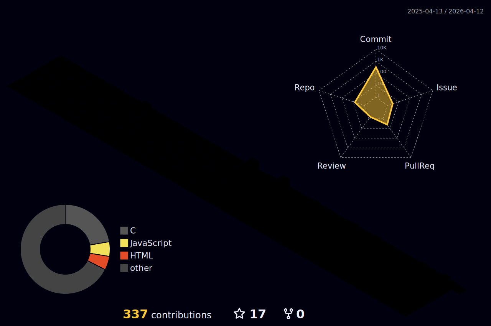

<div align="center">

[](https://git.io/typing-svg)

</div>

<div align="center">

🤖 **嵌入式系统开发者** | 🔧 **硬件设计工程师**

</div>

<div align="center">

[](https://github.com/evil0knight) [](https://github.com/evil0knight)

</div>

---

## 👨‍💻 关于我

江苏大学24级物联网工程专业在读,专注**嵌入式软硬件开发**。

拥有**智能车竞赛**(TC377视觉控制系统)、**机甲大师**(电源管理系统)等多个完整项目经验,
熟悉**STM32/TC377**平台开发,精通**C语言**、**控制算法**和**硬件设计**,
在**无代码传承**情况下独立完成8000+行代码的系统开发,具备较强的**自学能力**和**工程实践能力**。

**🎯 求职目标**: 2025届校招/实习 - 嵌入式软件/硬件工程师岗位

<br>

## 🛠️ 技术栈

### 💾 硬件平台


### 💻 编程语言


### 🔧 开发工具


<br>

## 📊 GitHub 统计与贡献

<div align="center">

### 3D 贡献日历



<br>

### 统计概览


<br>

### 贡献记录

[](https://git.io/streak-stats)

<br>

### 成就收藏

[](https://github.com/ryo-ma/github-profile-trophy)

</div>

<br>

## 🏆 核心项目

### 🚗 [智能车](https://github.com/evil0knight/JSU_Infin0)

**Smart Car Vision Control System**

[](https://github.com/evil0knight/JSU_Infin0)

```
🔧 硬件平台: 英飞凌 TC377 + 灰度摄像头
🎯 项目亮点: 无代码传承和学长指导,从零开始独立构建,队友不给力控制和视觉一人完成,大一
⚡ 技术栈:
   • 大津法图像分割 + 种子搜线算法
   • VMC(虚拟模型控制)五连杆悬架控制
   • 三级串级PID调优(角速度环+角度环+速度环)
   • 实时图像处理
📊 项目成果:
   • 竞赛成绩: 省2
   • 代码规模: C代码,含图像处理、电机控制等8大功能模块
   • 性能指标: 车速1.5m/s
   • 开发周期: 7个月,独立完成全部软件开发(硬件由团队完成)
```

---

### ⚡ [超级电容](https://github.com/evil0knight/RM_SUPERCAP_JSU)

**Supercapacitor Management System**

[](https://github.com/evil0knight/RM_SUPERCAP_JSU)

```
🔧 硬件平台: 半桥升降压电路 + STM32F1/F4
🎯 项目亮点: 借鉴开源项目快速开发,填补团队技术空白
⚡ 技术栈:
   • 电压电流采样电路(高精度ADC采样)
   • CAN总线通信协议(实时数据传输)
   • 充放电管理算法(SOC估算+过流保护)
   • Buck-Boost电力电子控制(PWM+闭环控制)
📊 项目成果:
   • 团队贡献: 成功交付模块,解决团队长期技术难题,现已量产使用
```

---


<br>

## ⚡ 专业技能

### 💻 嵌入式软件开发

✅ **平台开发**: 熟练使用Keil进行STM32开发,TC377平台开发经验
✅ **C语言精通**: 深入理解指针、链表、位操作、状态机等核心编程技巧
✅ **控制算法**: 熟悉PID控制、VMC五连杆控制等运动控制算法
✅ **图像处理**: 掌握大津法、种子搜线、特殊图像判断等视觉算法
✅ **系统设计**: 具备模块化设计、中断处理能力

### 🔧 嵌入式硬件设计

✅ **PCB设计**: 熟练使用Altium Designer/KiCad完成原理图和PCB设计
✅ **电路设计**: 掌握电源管理(Buck/Boost)、信号调理、滤波电路等硬件设计
✅ **器件选型**: 能根据需求选择合适的MCU、传感器、通信芯片等元器件
✅ **硬件调试**: 具备焊接、示波器/逻辑分析仪调试、问题定位能力

### 🚀 开发能力

✅ **版本控制**: 熟悉Git工作流程,具备团队协作开发经验
✅ **快速学习**: 善于从开源项目学习,在无代码传承情况下独立完成项目
✅ **工程实践**: 具备从0到1的项目经验

<br>

## 💡 核心优势

<div align="center">

|         💪 能力项         | 📝 详细描述                                    |
| :-----------------------: | :--------------------------------------------- |
| **🚀 自主学习能力** | 在无代码传承和学长指导情况下独立完成智能车项目 |
|  **🔧 全栈嵌入式**  | 精通算法开发、控制系统和硬件设计               |
|   **🏆 比赛经验**   | 智能车竞赛 & 机甲大师硬件组成员                |
|   **⚡ 快速交付**   | 善于从开源项目学习并快速交付实用方案           |
|   **👥 团队协作**   | 成功填补团队技术空白,解决关键问题              |

</div>

<br>

## 🎓 教育背景与竞赛

🏫 **江苏大学** - 物联网工程 (2024级本科在读)
🏆 **全国大学生智能车竞赛** - 如华东赛区/江苏省赛二等奖
🤖 **RoboMaster机甲大师赛** - 硬件组成员

---

## 📈 活动图表

<div align="center">

[](https://github.com/ashutosh00710/github-readme-activity-graph)

</div>

<br>

## 📫 联系方式与求职意向

<div align="center">

[](mailto:1744393991@qq.com)
[](https://github.com/evil0knight)

**📧 邮箱**: 1744393991@qq.com
**💼 求职意向**: 嵌入式软件/硬件工程师 (2025届应届生)
**📅 可入职时间**: 2025年6月 (实习可随时到岗)
**📍 意向城市**: 江苏/长三角地区/全国不限
**🎓 学历**: 江苏大学 物联网工程 本科在读 (2024级)
**🔍 求职状态**: 积极寻找校招/实习机会

</div>

